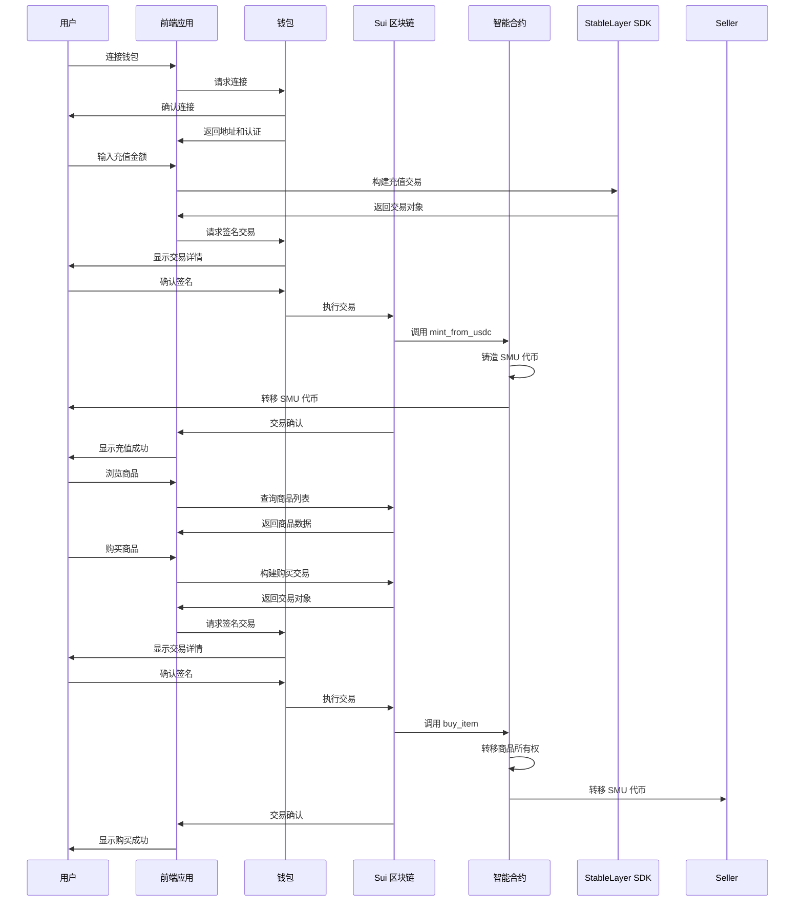

# 前后端集成计划

## 1. 集成概述

本计划详细说明 StableMarket 虚拟商品交易平台的前后端集成方案，包括前端应用与智能合约的交互、数据流向、API 设计和测试计划。

### 1.1 集成目标

- **实现完整的用户流程**：从钱包连接、稳定币充值到虚拟商品交易的全流程
- **确保数据一致性**：前端显示数据与区块链状态保持一致
- **提供良好的用户体验**：响应式界面、实时反馈和错误处理
- **确保安全性**：正确的签名验证和交易确认

## 2. 技术架构

### 2.1 集成架构

### 2.2 核心集成点

| 集成点 | 前端组件 | 智能合约函数 | 描述 |
|--------|----------|--------------|------|
| 钱包连接 | WalletConnectButton | N/A | 连接 Sui 钱包并获取用户地址 |
| 稳定币充值 | StableLayerRecharge | stable_integration::mint_from_usdc | 使用 StableLayer SDK 充值 USDC 并兑换为 SMU |
| 商品创建 | Marketplace | market::create_item | 创建新的虚拟商品 |
| 商品上架 | Marketplace | market::list_item | 上架商品并设置价格 |
| 商品购买 | Marketplace | market::buy_item | 购买商品并转移所有权 |
| 商品查询 | Marketplace | market::get_item_info | 查询商品详细信息 |

## 3. 前端集成实现

### 3.1 钱包集成

- **使用 @suiet/wallet-kit** 实现钱包连接
- **支持多钱包**：Sui Wallet、Suiet、Martian 等
- **自动检测**：检测用户是否已安装钱包
- **错误处理**：处理钱包连接失败、签名拒绝等情况

### 3.2 StableLayer SDK 集成

- **初始化客户端**：配置网络和默认发送者
- **构建交易**：使用 `buildMintTx` 构建充值交易
- **签名执行**：通过钱包签名并执行交易
- **交易监控**：监控交易状态和确认

### 3.3 智能合约交互

- **使用 @mysten/sui** 与 Sui 区块链交互
- **调用合约函数**：使用 `executeMoveCall` 调用智能合约
- **查询状态**：使用 `getObject` 和 `getDynamicFieldObject` 查询链上状态
- **事件监听**：监听合约事件以更新前端状态

### 3.4 状态管理

- **使用 Zustand** 管理全局状态
- **状态持久化**：本地存储用户偏好和会话信息
- **实时更新**：监听区块链事件以实时更新状态
- **错误状态**：统一管理和显示错误信息

## 4. 智能合约集成实现

### 4.1 合约部署

1. **编译合约**：使用 `sui move build` 编译智能合约
2. **测试合约**：使用 `sui move test` 运行单元测试
3. **部署合约**：使用 `sui client publish` 部署合约到 Sui 网络
4. **验证部署**：确认合约地址和模块 ID

### 4.2 合约配置

1. **初始化配置**：调用 `init_config` 初始化兑换配置
2. **设置费率**：调用 `update_exchange_rates` 设置手续费率
3. **创建代币**：调用 `init` 初始化 SMU 代币
4. **设置管理员**：配置平台管理员地址

### 4.3 事件设计

| 事件 | 合约 | 用途 | 前端处理 |
|------|------|------|----------|
| ExchangeEvent | stable_integration | 充值/提现事件 | 更新用户余额和交易历史 |
| TradeExecuted | market | 交易执行事件 | 更新商品状态和交易历史 |

## 5. 数据流向

### 5.1 前端到后端

1. **用户操作**：用户在前端界面执行操作（充值、购买等）
2. **交易构建**：前端使用 SDK 构建交易对象
3. **签名请求**：前端向钱包请求签名交易
4. **交易执行**：钱包将签名后的交易发送到 Sui 网络
5. **合约调用**：Sui 网络执行交易并调用相应的合约函数

### 5.2 后端到前端

1. **交易确认**：Sui 网络确认交易执行
2. **事件触发**：合约触发相应的事件
3. **状态更新**：区块链状态更新（余额、所有权等）
4. **前端查询**：前端查询最新状态或监听事件
5. **界面更新**：前端更新界面显示最新状态

## 6. 错误处理和边界情况

### 6.1 常见错误

| 错误类型 | 原因 | 前端处理 | 后端处理 |
|----------|------|----------|----------|
| 钱包连接失败 | 钱包未安装或拒绝连接 | 显示错误信息并引导用户安装钱包 | N/A |
| 交易签名拒绝 | 用户拒绝签名交易 | 显示取消提示并返回操作前状态 | N/A |
| 余额不足 | 用户 SMU 余额不足 | 显示余额不足提示并引导充值 | 合约断言失败并回滚 |
| 商品已售出 | 商品已被其他用户购买 | 显示商品已售出提示并更新商品状态 | 合约断言失败并回滚 |
| 网络错误 | 区块链网络拥堵或故障 | 显示网络错误提示并建议重试 | N/A |
| 合约错误 | 合约执行失败 | 显示合约错误信息并记录错误码 | 合约返回错误并回滚 |

### 6.2 边界情况

| 边界情况 | 处理方案 |
|----------|----------|
| 大额充值 | 前端显示风险提示，后端验证最小金额限制 |
| 高频交易 | 前端添加交易节流，后端实现交易队列 |
| 网络中断 | 前端保存操作状态，网络恢复后重试 |
| 钱包切换 | 前端检测钱包切换并重新初始化状态 |
| 页面刷新 | 前端恢复会话状态和钱包连接 |

## 7. 测试计划

### 7.1 单元测试

- **前端组件测试**：测试各个组件的渲染和交互
- **智能合约测试**：测试合约函数的功能和安全性
- **SDK 集成测试**：测试 StableLayer SDK 的调用和响应

### 7.2 集成测试

- **端到端测试**：测试完整的用户流程
- **跨钱包测试**：测试不同钱包的兼容性
- **网络环境测试**：测试不同网络环境下的性能

### 7.3 性能测试

- **交易速度测试**：测试不同金额的交易执行速度
- **并发用户测试**：测试多用户同时操作的系统稳定性
- **数据加载测试**：测试大量商品数据的加载性能

### 7.4 安全测试

- **签名验证测试**：测试签名验证的安全性
- **权限测试**：测试合约权限控制
- **输入验证测试**：测试前端和后端的输入验证

## 8. 部署和监控

### 8.1 部署流程

1. **前端构建**：使用 `npm run build` 构建前端应用
2. **前端部署**：部署到 Vercel 或其他托管服务
3. **智能合约部署**：部署到 Sui 测试网和主网
4. **配置更新**：更新前端配置文件中的合约地址
5. **DNS 配置**：配置域名和 SSL 证书

### 8.2 监控方案

- **前端监控**：使用 Sentry 监控前端错误
- **后端监控**：使用 Sui 网络监控工具监控合约状态
- **交易监控**：监控关键交易的执行状态
- **性能监控**：监控页面加载和交易执行性能

### 8.3 日志管理

- **前端日志**：记录用户操作和错误信息
- **后端日志**：记录合约调用和事件
- **交易日志**：记录所有交易的详细信息
- **分析日志**：用于业务分析和优化

## 9. 集成时间表

### 9.1 准备阶段（1-2 天）

1. **环境搭建**：配置开发环境和工具
2. **依赖安装**：安装所有必要的依赖包
3. **合约部署**：部署智能合约到测试网
4. **配置更新**：更新前端配置文件

### 9.2 核心集成阶段（3-5 天）

1. **钱包集成**：实现钱包连接功能
2. **StableLayer 集成**：实现稳定币充值功能
3. **商品管理集成**：实现商品创建和查询功能
4. **交易集成**：实现商品购买功能
5. **状态管理**：实现全局状态管理

### 9.3 测试阶段（2-3 天）

1. **单元测试**：运行所有单元测试
2. **集成测试**：测试完整的用户流程
3. **性能测试**：测试系统性能
4. **安全测试**：测试系统安全性

### 9.4 优化阶段（1-2 天）

1. **性能优化**：优化前端和后端性能
2. **用户体验优化**：改进用户界面和交互
3. **错误处理优化**：完善错误处理和提示
4. **文档更新**：更新技术文档和用户指南

### 9.5 部署阶段（1 天）

1. **生产环境部署**：部署到生产环境
2. **监控配置**：配置监控和警报
3. **最终测试**：在生产环境进行最终测试
4. **发布通知**：通知用户系统上线

## 10. 风险评估

### 10.1 技术风险

| 风险 | 可能性 | 影响 | 缓解措施 |
|------|--------|------|----------|
| 智能合约漏洞 | 低 | 高 | 严格的代码审查和安全测试 |
| SDK 集成问题 | 中 | 中 | 充分的集成测试和错误处理 |
| 网络拥堵 | 中 | 中 | 交易优先级设置和用户提示 |
| 钱包兼容性 | 中 | 低 | 支持多种钱包和兼容性测试 |

### 10.2 业务风险

| 风险 | 可能性 | 影响 | 缓解措施 |
|------|--------|------|----------|
| 用户操作错误 | 高 | 低 | 清晰的用户界面和操作引导 |
| 交易延迟 | 中 | 中 | 实时状态更新和用户提示 |
| 资金安全 | 低 | 高 | 多重签名和安全审计 |
| 系统宕机 | 低 | 高 | 高可用性设计和监控 |

## 11. 结论

本集成计划详细说明了 StableMarket 虚拟商品交易平台的前后端集成方案，包括技术架构、集成点、实现步骤、测试计划和风险评估。通过严格按照本计划执行，可以确保平台的顺利集成和稳定运行，为用户提供安全、高效、用户友好的虚拟商品交易体验。

### 11.1 成功标准

- **功能完整性**：所有核心功能正常工作
- **性能稳定性**：系统在高负载下稳定运行
- **安全性**：通过安全测试和审计
- **用户体验**：用户满意度高，操作流畅
- **可维护性**：代码结构清晰，文档完整

### 11.2 后续优化

1. **跨链集成**：支持其他区块链的稳定币
2. **流动性挖矿**：增加流动性挖矿功能
3. **去中心化治理**：引入 DAO 治理机制
4. **移动端应用**：开发 iOS 和 Android 应用
5. **元宇宙集成**：与元宇宙项目合作

通过本计划的实施，StableMarket 平台将成为一个领先的基于 Sui 区块链和 StableLayer SDK 的虚拟商品交易平台，为用户提供安全、高效、创新的交易体验。