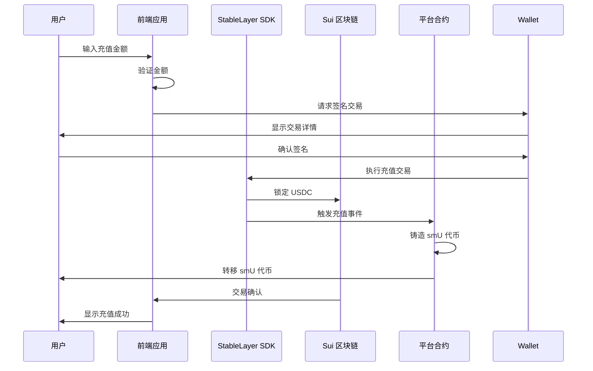
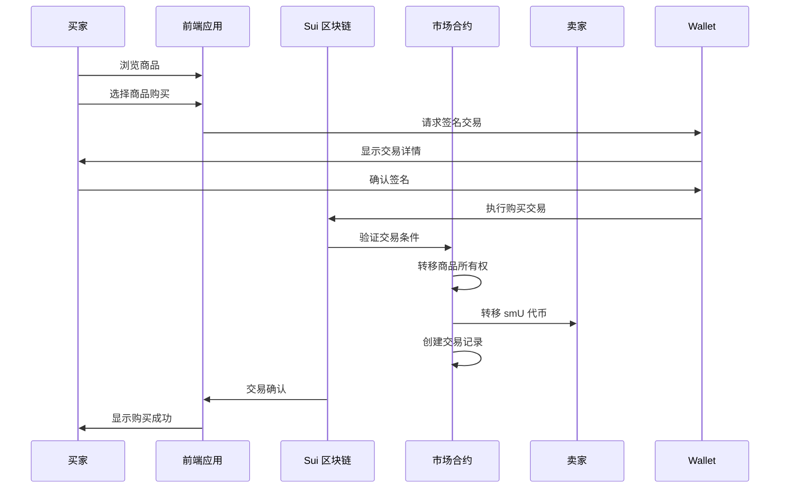

# 虚拟商品交易平台设计方案

## 1. 项目概述

本项目是一个基于 Sui 区块链的虚拟商品交易平台，使用 StableLayer SDK 实现稳定币充值功能，将 USDC 充值转换为平台专属代币 smU，并支持虚拟商品的交易、拍卖和收藏功能。

### 1.1 核心功能

- **稳定币充值**：使用 StableLayer SDK 将 USDC 转换为平台代币 smU
- **虚拟商品交易**：支持 NFT、游戏道具、虚拟地产等虚拟商品的交易
- **收益挖矿**：持有 smU 代币自动获得收益
- **安全交易**：基于 Sui 区块链的安全交易机制
- **用户友好界面**：现代化的 Web 前端界面

### 1.2 技术栈

- **前端**：Next.js 14 + React 19 + TypeScript + Tailwind CSS
- **智能合约**：Move 语言 (Sui 区块链)
- **充值技术**：StableLayer SDK
- **状态管理**：Zustand
- **区块链集成**：@mysten/sui + @suiet/wallet-kit

## 2. 技术架构

### 2.1 整体架构

```
┌─────────────────────────────────────────────────────────────┐
│                    前端应用层 (Next.js)                      │
├─────────────────────────────────────────────────────────────┤
│  React Components  │  State Management  │  Wallet Connect   │
├─────────────────────────────────────────────────────────────┤
│                    SDK集成层                              │
├─────────────────────────────────────────────────────────────┤
│  StableLayer SDK   │  Sui SDK           │  Wallet Kit       │
├─────────────────────────────────────────────────────────────┤
│                    智能合约层 (Move)                         │
├─────────────────────────────────────────────────────────────┤
│ Token │ User │ Stable │ Interest │ Market │ NFT             │
├─────────────────────────────────────────────────────────────┤
│                    Sui区块链网络                             │
└─────────────────────────────────────────────────────────────┘
```

### 2.2 模块设计

| 模块 | 职责 | 文件 |
|------|------|------|
| Token | 平台代币 smU 管理 | token.move |
| User | 用户账户管理 | user.move |
| Stable | StableLayer 集成 | stable_integration.move |
| Interest | 收益挖矿机制 | interest.move |
| Market | 交易撮合引擎 | market.move |
| NFT | NFT 商品管理 | nft_marketplace.move |

## 3. 智能合约设计

### 3.1 Token 模块 (token.move)

```move
module stb::token {
    use std::option::{Self, Option};
    use sui::balance::{Self, Balance};
    use sui::coin::{Self, Coin, CoinMetadata};
    use sui::object::{Self, UID};
    use sui::transfer;
    use sui::tx_context::{Self, TxContext};

    /// 平台代币类型
    struct smU has drop {}

    /// 代币管理权限
    struct TreasuryCap has key {
        id: UID,
        cap: coin::TreasuryCap<smU>
    }

    /// 初始化代币系统
    public fun init(witness: smU, ctx: &mut TxContext) {
        let (treasury_cap, metadata) = coin::create_currency(
            witness,
            6, // 6位小数精度
            b"StableMarket", // 代币名称
            b"smU", // 代币符号
            option::none(),
            ctx
        );
        transfer::share_object(metadata);
        transfer::transfer(TreasuryCap {
            id: object::new(ctx),
            cap: treasury_cap
        }, tx_context::sender(ctx));
    }

    /// 铸造代币
    public entry fun mint(
        treasury_cap: &mut TreasuryCap,
        amount: u64,
        ctx: &mut TxContext
    ): Coin<smU> {
        coin::mint(&mut treasury_cap.cap, amount, ctx)
    }

    /// 销毁代币
    public entry fun burn(
        treasury_cap: &mut TreasuryCap,
        coin: Coin<smU>
    ) {
        coin::burn(&mut treasury_cap.cap, coin)
    }
}
```

### 3.2 StableLayer 集成模块 (stable_integration.move)

```move
module stb::stable_integration {
    use std::option::{Self, Option};
    use sui::balance::{Self, Balance};
    use sui::coin::{Self, Coin};
    use sui::object::{Self, UID};
    use sui::transfer;
    use sui::tx_context::{Self, TxContext};
    use sui::event;

    use stb::token::{smU, TreasuryCap};

    /// 兑换记录
    struct ExchangeRecord has key {
        id: UID,
        user: address,
        from_amount: u64,
        to_amount: u64,
        exchange_type: u8, // 0 = mint, 1 = burn
        timestamp: u64
    }

    /// 兑换事件
    struct ExchangeEvent has copy, drop {
        user: address,
        from_amount: u64,
        to_amount: u64,
        exchange_type: u8,
        timestamp: u64
    }

    /// 兑换配置
    struct ExchangeConfig has key {
        id: UID,
        mint_fee_rate: u64, // 铸造手续费率 (万分比)
        burn_fee_rate: u64, // 销毁手续费率 (万分比)
        min_exchange_amount: u64 // 最小兑换金额
    }

    /// 初始化兑换配置
    public fun init_config(ctx: &mut TxContext) {
        let config = ExchangeConfig {
            id: object::new(ctx),
            mint_fee_rate: 10, // 0.1% 手续费
            burn_fee_rate: 10, // 0.1% 手续费
            min_exchange_amount: 1000000 // 1 USDC最小金额
        };
        transfer::share_object(config);
    }

    /// USDC兑换为smU (充值)
    public entry fun mint_from_usdc(
        usdc_coin: Coin<USDC>,
        treasury_cap: &mut TreasuryCap,
        config: &ExchangeConfig,
        ctx: &mut TxContext
    ) {
        let user = tx_context::sender(ctx);
        let usdc_amount = coin::value(&usdc_coin);
        let timestamp = tx_context::epoch(ctx);
        
        // 验证最小金额
        assert!(usdc_amount >= config.min_exchange_amount, EAmountTooSmall);
        
        // 计算手续费
        let fee = (usdc_amount * config.mint_fee_rate) / 10000;
        let smu_amount = usdc_amount - fee;
        
        // 转移USDC到平台地址
        transfer::public_transfer(usdc_coin, @platform_treasury);
        
        // 铸造smU代币给用户
        let smu_coin = stb::token::mint(treasury_cap, smu_amount, ctx);
        
        // 创建兑换记录
        let record = ExchangeRecord {
            id: object::new(ctx),
            user,
            from_amount: usdc_amount,
            to_amount: smu_amount,
            exchange_type: 0, // mint
            timestamp
        };
        
        // 发出事件
        event::emit(ExchangeEvent {
            user,
            from_amount: usdc_amount,
            to_amount: smu_amount,
            exchange_type: 0,
            timestamp
        });
        
        transfer::transfer(record, user);
        transfer::public_transfer(smu_coin, user);
    }

    // 错误代码
    const EAmountTooSmall: u64 = 1;
    const EUnauthorized: u64 = 2;
    
    // USDC类型定义
    public struct USDC has drop {}
}
```

### 3.3 市场模块 (market.move)

```move
module stb::market {
    use std::option::{Self, Option};
    use sui::balance::{Self, Balance};
    use sui::coin::{Self, Coin};
    use sui::object::{Self, UID};
    use sui::transfer;
    use sui::tx_context::{Self, TxContext};
    use sui::event;

    use stb::token::smU;

    /// 虚拟商品
    struct VirtualItem has key {
        id: UID,
        owner: address,
        name: String,
        description: String,
        category: u8, // 0 = NFT, 1 = 游戏道具, 2 = 虚拟地产
        price: u64,
        is_listed: bool,
        metadata_uri: String
    }

    /// 交易订单
    struct Order has key {
        id: UID,
        owner: address,
        item_id: UID,
        price: u64,
        order_type: u8, // 0 = 买单, 1 = 卖单
        created_at: u64
    }

    /// 交易记录
    struct Trade has key {
        id: UID,
        buyer: address,
        seller: address,
        item_id: UID,
        price: u64,
        timestamp: u64
    }

    /// 交易事件
    struct TradeExecuted has copy, drop {
        trade_id: UID,
        buyer: address,
        seller: address,
        item_id: UID,
        price: u64,
        timestamp: u64
    }

    /// 创建虚拟商品
    public entry fun create_item(
        name: String,
        description: String,
        category: u8,
        metadata_uri: String,
        ctx: &mut TxContext
    ) {
        let owner = tx_context::sender(ctx);
        let item = VirtualItem {
            id: object::new(ctx),
            owner,
            name,
            description,
            category,
            price: 0,
            is_listed: false,
            metadata_uri
        };
        transfer::transfer(item, owner);
    }

    /// 上架商品
    public entry fun list_item(
        item: &mut VirtualItem,
        price: u64,
        ctx: &mut TxContext
    ) {
        assert!(item.owner == tx_context::sender(ctx), EUnauthorized);
        assert!(price > 0, EInvalidPrice);
        
        item.price = price;
        item.is_listed = true;
    }

    /// 购买商品
    public entry fun buy_item(
        item: &mut VirtualItem,
        payment: Coin<smU>,
        ctx: &mut TxContext
    ) {
        let buyer = tx_context::sender(ctx);
        let seller = item.owner;
        let price = item.price;
        let payment_amount = coin::value(&payment);
        let timestamp = tx_context::epoch(ctx);
        
        assert!(item.is_listed, EItemNotListed);
        assert!(buyer != seller, ESelfTransaction);
        assert!(payment_amount >= price, EInsufficientFunds);
        
        // 转移资金给卖家
        transfer::public_transfer(payment, seller);
        
        // 转移商品所有权
        item.owner = buyer;
        item.is_listed = false;
        
        // 创建交易记录
        let trade = Trade {
            id: object::new(ctx),
            buyer,
            seller,
            item_id: item.id,
            price,
            timestamp
        };
        
        // 发出交易事件
        event::emit(TradeExecuted {
            trade_id: trade.id,
            buyer,
            seller,
            item_id: item.id,
            price,
            timestamp
        });
        
        transfer::transfer(trade, @market_admin);
    }

    // 错误代码
    const EUnauthorized: u64 = 1;
    const EInvalidPrice: u64 = 2;
    const EItemNotListed: u64 = 3;
    const ESelfTransaction: u64 = 4;
    const EInsufficientFunds: u64 = 5;
}
```

## 4. 前端实现

### 4.1 项目结构

```
frontend/
├── src/
│   ├── app/
│   │   ├── dashboard/
│   │   │   └── page.tsx
│   │   ├── marketplace/
│   │   │   └── page.tsx
│   │   ├── wallet/
│   │   │   └── page.tsx
│   │   ├── stablelayer/
│   │   │   └── page.tsx
│   │   ├── layout.tsx
│   │   └── page.tsx
│   ├── components/
│   │   ├── ui/
│   │   ├── WalletConnectButton.tsx
│   │   └── StableLayerRecharge.tsx
│   ├── hooks/
│   │   ├── useStableLayer.ts
│   │   └── useWallet.ts
│   ├── lib/
│   │   ├── stablelayer.ts
│   │   └── utils.ts
│   └── stores/
│       ├── useMarketStore.ts
│       └── useUserStore.ts
├── package.json
└── tsconfig.json
```

### 4.2 StableLayer SDK 集成

```typescript
// src/lib/stablelayer.ts
import { StableLayerClient } from "stable-layer-sdk";
import { SuiClient, getFullnodeUrl } from "@mysten/sui/client";

export const stableLayerClient = new StableLayerClient({
  network: "testnet",
});

export const suiClient = new SuiClient({
  url: getFullnodeUrl("testnet"),
});

// 构建充值交易
export async function buildMintTransaction({
  usdcAmount,
  sender,
}: {
  usdcAmount: number;
  sender: string;
}) {
  const tx = new Transaction();
  
  const result = await stableLayerClient.buildMintTx({
    tx,
    stableCoinType: "0xstablelayer::smu::smU",
    usdcCoin: coinWithBalance({
      balance: BigInt(usdcAmount * 1_000_000), // USDC 6位小数
      type: "0xusdc::usdc::USDC",
    })(tx),
    amount: BigInt(usdcAmount * 1_000_000),
  });
  
  return tx;
}

// 构建提现交易
export async function buildBurnTransaction({
  smuAmount,
  sender,
}: {
  smuAmount: number;
  sender: string;
}) {
  const tx = new Transaction();
  
  await stableLayerClient.buildBurnTx({
    tx,
    stableCoinType: "0xstablelayer::smu::smU",
    amount: BigInt(smuAmount * 1_000_000), // smU 6位小数
  });
  
  return tx;
}
```

### 4.3 充值组件

```tsx
// src/components/StableLayerRecharge.tsx
import { useState } from "react";
import { useWallet } from "@suiet/wallet-kit";
import { Button } from "@/components/ui/button";
import { Input } from "@/components/ui/input";
import { Label } from "@/components/ui/label";
import { Card, CardContent, CardHeader, CardTitle } from "@/components/ui/card";
import { Alert, AlertDescription } from "@/components/ui/alert";
import { buildMintTransaction, suiClient } from "@/lib/stablelayer";

export function StableLayerRecharge() {
  const wallet = useWallet();
  const [amount, setAmount] = useState("1");
  const [loading, setLoading] = useState(false);
  const [error, setError] = useState<string | null>(null);
  const [success, setSuccess] = useState<string | null>(null);

  const handleRecharge = async () => {
    if (!wallet.connected || !wallet.address) {
      setError("请先连接钱包");
      return;
    }

    setLoading(true);
    setError(null);
    setSuccess(null);

    try {
      const tx = await buildMintTransaction({
        usdcAmount: parseFloat(amount),
        sender: wallet.address,
      });

      const result = await wallet.signAndExecuteTransaction({
        transaction: tx,
      });

      setSuccess(`充值成功！交易哈希: ${result.digest.substring(0, 10)}...`);
      setAmount("1");
    } catch (err) {
      setError(`充值失败: ${err instanceof Error ? err.message : "未知错误"}`);
    } finally {
      setLoading(false);
    }
  };

  return (
    <Card>
      <CardHeader>
        <CardTitle>稳定币充值</CardTitle>
      </CardHeader>
      <CardContent>
        {error && (
          <Alert variant="destructive" className="mb-4">
            <AlertDescription>{error}</AlertDescription>
          </Alert>
        )}
        
        {success && (
          <Alert variant="default" className="mb-4">
            <AlertDescription>{success}</AlertDescription>
          </Alert>
        )}

        <div className="space-y-4">
          <div>
            <Label htmlFor="amount">充值金额 (USDC)</Label>
            <Input
              id="amount"
              type="number"
              value={amount}
              onChange={(e) => setAmount(e.target.value)}
              min="0.01"
              step="0.01"
              placeholder="输入充值金额"
            />
          </div>
          
          <div className="text-sm text-muted-foreground">
            1 USDC = 1 smU (平台代币)
          </div>

          <Button
            onClick={handleRecharge}
            disabled={loading || !wallet.connected}
            className="w-full"
          >
            {loading ? "处理中..." : "确认充值"}
          </Button>
        </div>
      </CardContent>
    </Card>
  );
}
```

## 5. 充值流程

### 5.1 充值流程图



### 5.2 关键步骤

1. **用户操作**：在前端界面输入充值金额
2. **交易构建**：使用 StableLayer SDK 构建充值交易
3. **签名确认**：用户通过钱包确认交易
4. **交易执行**：StableLayer SDK 执行充值操作
5. **代币铸造**：平台合约铸造相应数量的 smU 代币
6. **资金转移**：smU 代币转移到用户账户
7. **交易确认**：前端显示充值成功信息

## 6. 交易流程

### 6.1 商品购买流程



## 7. 安全考虑

### 7.1 智能合约安全

- **访问控制**：严格的权限管理
- **参数验证**：所有输入参数的有效性验证
- **重入攻击防护**：使用检查-效果-交互模式
- **整数溢出**：使用安全的算术操作
- **时间戳操纵**：防止时间戳操纵攻击

### 7.2 前端安全

- **钱包连接**：使用官方 Wallet Kit
- **交易确认**：用户确认所有交易
- **输入验证**：前端输入验证
- **HTTPS**：强制使用 HTTPS 连接
- **XSS 防护**：使用 React 的安全渲染

### 7.3 资金安全

- **多重签名**：平台资金使用多重签名管理
- **冷钱包存储**：大部分资金存储在冷钱包
- **交易监控**：实时监控异常交易
- **保险覆盖**：考虑购买智能合约保险

## 8. 部署计划

### 8.1 部署步骤

1. **智能合约部署**
   - 编译 Move 合约
   - 部署到 Sui 测试网
   - 验证合约功能

2. **前端部署**
   - 构建 Next.js 应用
   - 部署到 Vercel 或其他托管服务
   - 配置域名和 SSL

3. **集成测试**
   - 端到端测试充值功能
   - 测试商品交易流程
   - 验证收益挖矿功能

4. **安全审计**
   - 智能合约安全审计
   - 前端安全测试
   - 渗透测试

5. **主网部署**
   - 部署到 Sui 主网
   - 启动正式服务
   - 监控系统运行

### 8.2 测试计划

| 测试阶段 | 测试内容 | 预期结果 |
|---------|---------|----------|
| 单元测试 | 智能合约功能 | 所有测试通过 |
| 集成测试 | 前后端交互 | 功能正常 |
| 端到端测试 | 完整流程 | 流程顺畅 |
| 压力测试 | 高并发交易 | 系统稳定 |
| 安全测试 | 漏洞扫描 | 无严重漏洞 |

## 9. 项目优势

1. **技术创新性**：结合 Sui 区块链和 StableLayer SDK，实现高效稳定的充值系统
2. **用户友好**：现代化的前端界面，简化用户操作流程
3. **安全可靠**：基于区块链的安全交易机制
4. **收益机制**：持有平台代币自动获得收益
5. **扩展性强**：模块化设计，易于添加新功能
6. **符合标准**：使用标准的 Move 语言和 Sui 区块链接口

## 10. 未来规划

1. **跨链集成**：支持其他区块链的稳定币
2. **流动性挖矿**：增加流动性挖矿功能
3. **去中心化治理**：引入 DAO 治理机制
4. **移动端应用**：开发 iOS 和 Android 应用
5. **元宇宙集成**：与元宇宙项目合作
6. **API 开放**：提供开放 API 供第三方集成

## 11. 结论

本设计方案提供了一个完整的虚拟商品交易平台解决方案，使用 StableLayer SDK 实现稳定币充值功能，将 USDC 转换为平台代币 smU，并支持虚拟商品的交易功能。方案采用现代化的技术栈，确保系统的安全性、可靠性和用户友好性。

通过本方案的实施，可以创建一个安全、高效、用户友好的虚拟商品交易平台，为用户提供便捷的虚拟商品交易服务，同时为平台运营者创造商业价值。